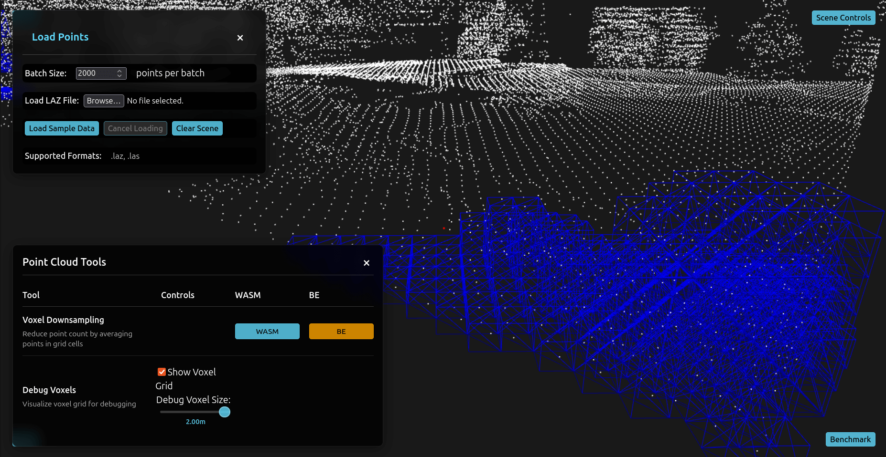

# Point Cloud Web Tools



## Overview

This project provides a platform for building and testing point cloud processing tools across different implementations and execution environments. It supports benchmarking, testing, and development of point cloud algorithms.

**Current Implementations:**
- Voxel Downsampling
- Voxel Debug Visualization
- Point Cloud Smoothing

## 🚀 Quick Start

```bash
# Install dependencies
yarn

# Start development server (frontend + backend)
yarn dev
```

### Prerequisites
- **Node.js 18+** and yarn
- **Emscripten** (`emcc`) - Required for building C++ WASM modules (frontend auto-builds on startup)
- **Rust** (cargo) - Required for building Rust WASM modules (`wasm-pack` auto-installs if missing)
- **Python 3.x** - Optional, only needed for Python backend tools

**Note**: If WASM compilation fails, ensure `frontend/compile_wasm.sh` is executable:
```bash
chmod +x frontend/compile_wasm.sh
```

## 📊 Benchmarking

This repository includes comprehensive benchmarking tools and results. See [docs/benchmarking/benchmark.md](docs/benchmarking/benchmark.md) for details.

## 🏗️ Architecture

### Frontend
- **Framework**: React + TypeScript
- **Rendering**: Babylon.js for 3D visualization
- **WASM**: Emscripten (C++) and wasm-bindgen (Rust)
- **Workers**: Web Workers for parallel WASM execution

### Backend
- **Server**: Node.js + Express
- **WebSocket**: Real-time communication for backend processing
- **Executables**: Standalone C++/Rust/Python binaries


## 📝 Supported Formats

- **LAZ/LAS**: Traditional point cloud formats
<!-- - **COPC**: Cloud Optimized Point Cloud with LOD support -->
