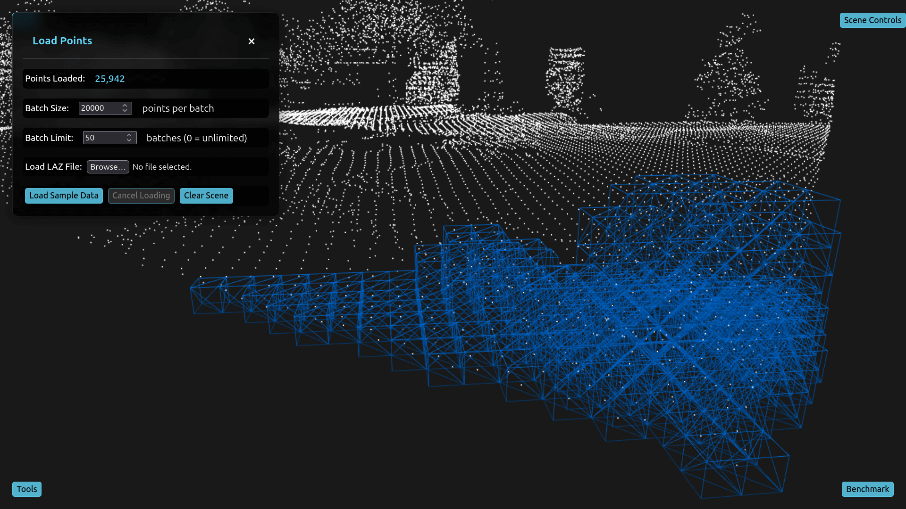

# Point Cloud Web Tools



[📹 Watch Demo Video](https://youtu.be/nZjpiuyGGBQ)

## Overview

This project provides a platform for building and testing point cloud processing tools across different implementations and execution environments. It supports benchmarking, testing, and development of point cloud algorithms.

**Current Implementations:**

- Voxel Downsampling
- Voxel Debug Visualization
- Point Cloud Smoothing

## 🚀 Quick Start

```bash
# Install dependencies
yarn

# Start development server (frontend + backend)
yarn dev
```

### Prerequisites

- **Node.js 18+** and yarn
- **Emscripten** (`emcc`) - Required for building C++ WASM modules (frontend auto-builds on startup)
- **Rust** (cargo) - Required for building Rust WASM modules and backend executables (`wasm-pack` auto-installs if missing)
- **Python 3.x** - Required for Python backend tools (Cython implementations)
- **Cython** - Required for Python Cython backend tools
- **C/C++ Compiler** (clang++ or g++) - Required for building C++ backend executables and compiling Cython extensions

**Note**: If WASM compilation fails, ensure `frontend/compile_wasm.sh` is executable:

```bash
chmod +x frontend/compile_wasm.sh
```

## 📊 Benchmarking

This repository includes comprehensive benchmarking tools and results. See [docs/benchmarking/benchmark.md](docs/benchmarking/benchmark.md) for details.

## 🏗️ Architecture

### Frontend

- **Framework**: React + TypeScript
- **Rendering**: Babylon.js for 3D visualization
- **WASM**: Emscripten (C++) and wasm-bindgen (Rust)
- **Workers**: Web Workers for parallel WASM execution

### Backend

- **Server**: Node.js + Express
- **WebSocket**: Real-time communication for backend processing
- **Executables**: Standalone C++/Rust/Python binaries

## 📝 Supported Formats

- **LAZ/LAS**: Traditional point cloud formats
<!-- - **COPC**: Cloud Optimized Point Cloud with LOD support -->

## 🔍 Linting

The project uses ESLint for code quality. Run linting from the root directory:

```bash
# Lint both frontend and backend
yarn lint

# Lint only frontend
yarn lint:frontend

# Lint only backend
yarn lint:backend
```

Format code with Prettier:

```bash
# Format both frontend and backend
yarn format

# Check formatting without fixing
yarn format:check
```

## 🧪 Testing

Tests are colocated next to source files (e.g., `BaseService.ts` → `BaseService.test.ts`).

```bash
# Run all tests
yarn test

# Run specific tests
yarn test:frontend    # Frontend (Vitest)
yarn test:backend     # Backend (Vitest)
yarn test:rust        # Rust (cargo test)

# Watch mode
yarn test:watch

# Coverage
yarn test:coverage
```
